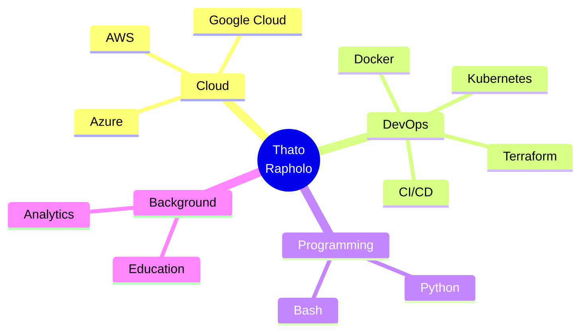
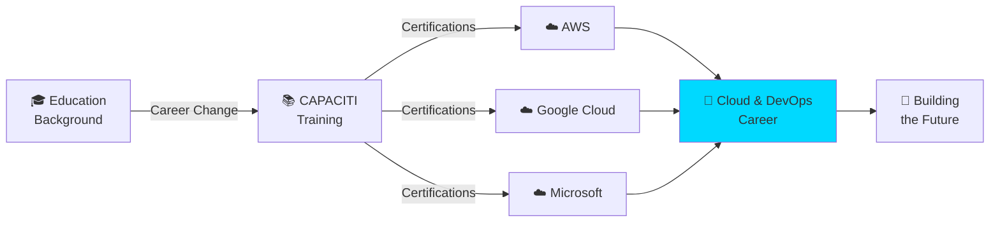

## 🎯 My Tech Journey

<h1 align="center">
  
</h1>

<p align="center">
  
  
  
  
</p>

<div align="center">
  
  ### 💭 My Journey
  
  *"From teaching classroom foundations to building cloud infrastructure—*  
  *bringing structure, reliability, and accessibility to digital systems."*
  
</div>

---

## 🚀 About Me

<table>
<tr>
<td>

**Current Role:** Cloud & DevOps Learner @ CAPACITI  
**Previous Life:** Educator  
**Location:** Pretoria, South Africa  
**Status:** Career Changer | Lifelong Learner | Cloud Enthusiast

</td>
</tr>
</table>

## 🏆 Certifications & Achievements

### 📜 My Certifications

<table>
  <tr>
    <td align="center" width="33%">
      
      <br/><strong>AWS Cloud Practitioner</strong>
      <br/>
      <a href="YOUR_CREDLY_BADGE_URL">
        
      </a>
    </td>
    <td align="center" width="33%">
      
      <br/><strong>AWS DevOps</strong>
      <br/>
      <a href="YOUR_CREDLY_BADGE_URL">
        
      </a>
    </td>
    <td align="center" width="33%">
      
      <br/><strong>Google Cloud GenAI</strong>
      <br/>
      <a href="YOUR_CREDENTIAL_URL">
        
      </a>
    </td>
  </tr>
</table>
```


### 🎯 Current Focus

<table>
<tr>
<td width="33%"><strong>🌱 Learning</strong></td>
<td width="33%"><strong>🔨 Building</strong></td>
<td width="33%"><strong>🎯 Goal</strong></td>
</tr>
<tr>
<td>
  
- Kubernetes<br/>
- Terraform<br/>
- Docker<br/>
- Python<br/>
- CI/CD

</td>
<td>
  
- Infrastructure Labs<br/>
- Automation Scripts<br/>
- Portfolio Projects

</td>
<td>
  
Contributing to scalable, reliable cloud infrastructure

</td>
</tr>
</table>

### ⚡ Fun Fact
I explain Kubernetes like I'm teaching 5-year-olds (and it actually works!) 🎓➡️☁️

---

## 🛤️ My Learning Journey


---

## 🏆 Certifications & Achievements

<p align="center">
  
  
  
</p>

<p align="center">
  
</p>

---

## 🛠️ Technical Arsenal

<div align="center">

### Cloud Platforms


### DevOps & Tools


### Languages & Scripting


</div>

**Current Skill Levels:**
```text
Cloud Platforms    ████████░░ 80%  (AWS, GCP, Azure fundamentals)
Containers         ███████░░░ 70%  (Docker proficient, learning K8s)
IaC & Automation   ██████░░░░ 60%  (Terraform, scripting)
CI/CD              █████░░░░░ 50%  (Building first pipelines)
Programming        ██████░░░░ 60%  (Python, Bash)
```

---

## 🗺️ My Learning Roadmap

### ✅ Completed
- [x] AWS Cloud Practitioner Essentials
- [x] AWS DevOps (Code, Build, Test)
- [x] Google Cloud: Intro to Generative AI
- [x] Microsoft Power Platform Fundamentals
- [x] Google Analytics Certification

### 🔄 In Progress
- [ ] Kubernetes Administration
- [ ] Terraform Deep Dive
- [ ] Building CI/CD Pipelines
- [ ] Python for DevOps

### 🎯 Coming Next
- [ ] Docker Mastery
- [ ] AWS Solutions Architect
- [ ] Advanced K8s Patterns
- [ ] Site Reliability Engineering

---

## 🚀 What I'm Building

<table>
  <tr>
    <td width="50%">
      <h3 align="center">☁️ AWS Infrastructure Labs</h3>
      <p align="center">
        
      </p>
      <p align="center">
        Building scalable VPC architecture with Terraform, implementing best practices for security and high availability.
      </p>
      <p align="center">
        <strong>Tech:</strong> AWS, Terraform, VPC, EC2, S3
      </p>
    </td>
    <td width="50%">
      <h3 align="center">🚀 CI/CD Pipeline Demo</h3>
      <p align="center">
        
      </p>
      <p align="center">
        Automated deployment pipeline with GitHub Actions, Docker containers, and AWS deployment.
      </p>
      <p align="center">
        <strong>Tech:</strong> GitHub Actions, Docker, AWS ECS
      </p>
    </td>
  </tr>
  <tr>
    <td width="50%">
      <h3 align="center">🤖 DevOps Automation Scripts</h3>
      <p align="center">
        
      </p>
      <p align="center">
        Collection of Python and Bash scripts for common DevOps tasks and infrastructure automation.
      </p>
      <p align="center">
        <strong>Tech:</strong> Python, Bash, AWS CLI
      </p>
    </td>
    <td width="50%">
      <h3 align="center">📚 Cloud Learning Notes</h3>
      <p align="center">
        
      </p>
      <p align="center">
        Documenting my cloud journey—concepts, labs, and lessons learned. Learning in public!
      </p>
      <p align="center">
        <strong>Tech:</strong> Markdown, Documentation
      </p>
    </td>
  </tr>
</table>

*More projects coming soon as I build and learn!*

---

## 📊 GitHub Analytics

<p align="center">
  
  
</p>

<p align="center">
  
</p>

<p align="center">
  
</p>

---

## 💡 What Makes Me Different

<table>
  <tr>
    <td align="center" width="25%">
      
      <br /><strong>Fresh Perspective</strong>
      <br />Education background brings user-centered thinking to infrastructure
    </td>
    <td align="center" width="25%">
      
      <br /><strong>Growth Mindset</strong>
      <br />Proven ability to learn complex systems through career transition
    </td>
    <td align="center" width="25%">
      
      <br /><strong>Communication</strong>
      <br />Can explain technical concepts clearly (like teaching!)
    </td>
    <td align="center" width="25%">
      
      <br /><strong>Committed</strong>
      <br />5 certifications and counting—dedication speaks volumes
    </td>
  </tr>
</table>

---

## ⚡ Fun Facts About Me

- 🎓 **Career Changer:** From teaching ABCs to deploying APIs!
- 📚 **Learning Style:** I explain cloud concepts like teaching 5-year-olds (seriously effective!)
- ☁️ **Cloud Obsessed:** Completed 5 certifications in my transition journey
- 🌍 **Location:** Pretoria, but building for the world
- 💪 **Superpower:** Turning complex technical jargon into plain English
- ☕ **Fuel:** Curiosity, determination, and good coffee
- 🚀 **Motto:** "Learn in public, fail fast, iterate faster"
- 🎯 **Mission:** Making cloud infrastructure accessible and reliable for everyone

---

## 📅 This Week I'm Focused On
```yaml
week: 15-19 December 2025
learning:
  - Kubernetes networking deep dive
  - Terraform state management best practices
  - Python automation for AWS tasks
building:
  - Multi-tier AWS VPC architecture
  - GitHub Actions CI/CD workflow
  - DevOps automation script library
reading:
  - "The Phoenix Project" by Gene Kim
  - AWS Well-Architected Framework
next_cert: "Kubernetes CKA"
mood: "Excited and making progress! 💪"
```

---

## 🎮 Choose Your Path

<div align="center">

**What would you like to explore?**

[📜 View Certifications](#-certifications--achievements) • 
[🛠️ See Tech Stack](#%EF%B8%8F-technical-arsenal) • 
[🚀 Check Projects](#-what-im-building) • 
[📖 Read My Story](#-about-me) • 
[🤝 Let's Connect](#-lets-connect)

</div>

---

## 🤝 Let's Connect

<p align="center">
  <a href="https://www.linkedin.com/in/thato-rapholo/">
    
  </a>
  <a href="mailto:rapholothato3@gmail.com">
    
  </a>
  <a href="https://github.com/Trapholo01">
    
  </a>
</p>

<div align="center">
  
  ### 💬 Open to Opportunities
  
  I'm actively seeking **entry-level Cloud Engineer or DevOps** roles where I can contribute, learn, and grow.  
  If you're building reliable, scalable systems and value fresh perspectives, let's talk!
  
  ---
  
  💭 *"Every expert was once a beginner who refused to give up."*  
  **I'm documenting my journey from education to cloud infrastructure—one commit at a time.**
  
  ⭐️ **From [Trapholo01](https://github.com/Trapholo01)** | Built with 💙 and lots of ☕
  
</div>

---

<p align="center">
  
</p>
